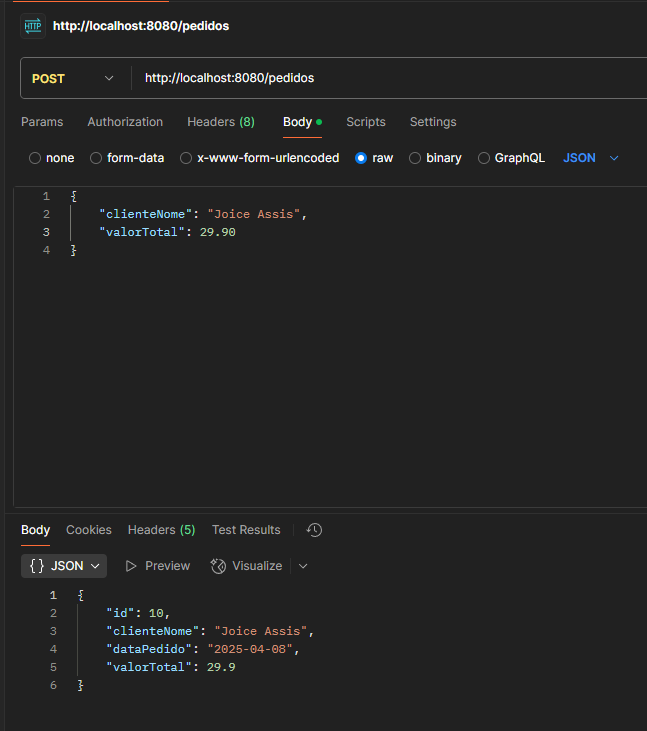

# API de Pedidos - Checkpoint 1

API RESTful para cadastro e gerenciamento de pedidos de clientes, desenvolvida em Spring Boot 3 com banco de dados H2 (em memória).

## Requisitos
- Java 17
- Maven
- Spring Boot 3.1+

## Como Executar
1. Navegue até a pasta do projeto
2. Execute o comando: `mvn spring-boot:run`
3. Acesse o Banco de Dados da API em: [localhost:8080/h2-console/login.do](http://localhost:8080/h2-console/login.do)
4. Acesse os pedidos da API em: [localhost:8080/pedidos](http://localhost:8080/pedidos)

## Endpoints

| Método | Endpoint          | Descrição                     |
|--------|-------------------|-------------------------------|
| GET    | /pedidos          | Lista todos os pedidos        |
| GET    | /pedidos/{id}     | Busca pedido por ID           |
| POST   | /pedidos          | Cria novo pedido              |
| PUT    | /pedidos/{id}     | Atualiza pedido existente     |
| DELETE | /pedidos/{id}     | Remove pedido                 |

## Exemplos de Requests/Responses

### 1. Criar Pedido (POST)
**Request:** POST http://localhost:8080/pedidos
# API de Pedidos - Checkpoint 1

API RESTful para cadastro e gerenciamento de pedidos de clientes, desenvolvida em Spring Boot 3 com banco de dados H2 (em memória).

## Requisitos
- Java 17
- Maven
- Spring Boot 3.1+

## Como Executar
1. Navegue até a pasta do projeto
2. Execute o comando: `mvn spring-boot:run`
3. Acesse o Banco de Dados da API em: [localhost:8080/h2-console/login.do](http://localhost:8080/h2-console/login.do)
4. Acesse os pedidos da API em: [localhost:8080/pedidos](http://localhost:8080/pedidos)

## Endpoints

| Método | Endpoint          | Descrição                     |
|--------|-------------------|-------------------------------|
| GET    | /pedidos          | Lista todos os pedidos        |
| GET    | /pedidos/{id}     | Busca pedido por ID           |
| POST   | /pedidos          | Cria novo pedido              |
| PUT    | /pedidos/{id}     | Atualiza pedido existente     |
| DELETE | /pedidos/{id}     | Remove pedido                 |

## Exemplos de Requests/Responses

### 1. Criar Pedido (POST)
**Request:** POST http://localhost:8080/pedidos
É só preencher a requisição em formato JSON e com as informações obrigatórias das coluna:

